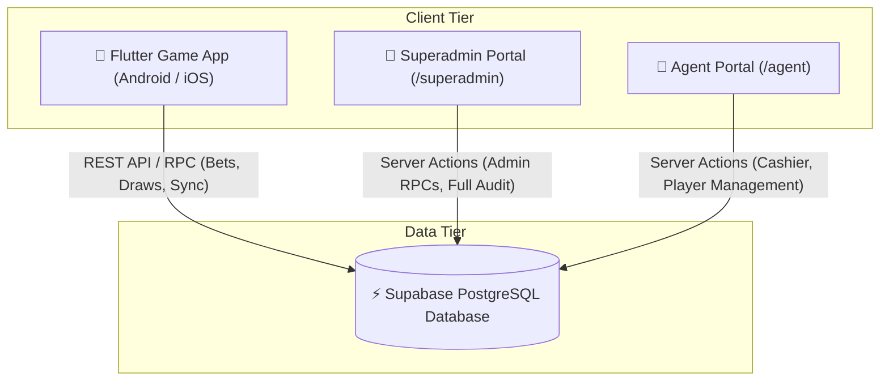

# 📘 MASTER TECHNICAL SPECIFICATION
## Web Dashboard, Database Schema & Game App Synchronization Blueprint

> **Purpose**: This document is the comprehensive, exhaustive single source of truth (SSOT) for developers and AI coding agents working on the **BSG Gaming System** (Web Dashboard, Supabase Database, and Flutter Game App).

---

## 📂 1. System Architecture Overview

---

## 🗄️ 2. Database Schema & Canonical Column Definitions

### Table 1: `triple_chance_rounds` (Global Synchronized Game Draws)
- **Primary Key**: `id` (`UUID`)
- **Columns**:
  - `round_number` (`INT8` / `BIGINT`): Incremental global round index (e.g. `#101`, `#102`).
  - `scheduled_at` (`TIMESTAMPTZ`): Scheduled draw completion time (103-second cycle).
  - `status` (`TEXT`): `'ACTIVE'`, `'CALCULATING'`, `'COMPLETED'`.
  - **Digit Outcome Columns** (**CRITICAL - DO NOT ALTER ALIASES**):
    - `red` (`INT4`): Outcome digit for RED wheel (0–9).
    - `green` (`INT4`): Outcome digit for GREEN wheel (0–9).
    - `black` (`INT4`): Outcome digit for BLACK wheel (0–9).
  - `created_at` (`TIMESTAMPTZ`): Server round generation timestamp.

> ⚠️ **CRITICAL RULE**: Column names are `red`, `green`, `black`. **NEVER** query `red_digit`, `green_digit`, or `black_digit` on `triple_chance_rounds`.

---

### Table 2: `triple_chance_bets` (Multiplayer Player Bets)
- **Primary Key**: `id` (`UUID`)
- **Foreign Keys**:
  - `round_id` (`UUID` $\rightarrow$ `triple_chance_rounds.id`)
  - `user_id` (`UUID` $\rightarrow$ `profiles.id`)
- **Columns**:
  - `single_bets` (`JSONB`): Single digit wagers `{"0": 10, "5": 50}`.
  - `double_bets` (`JSONB`): Double digit wagers `{"12": 20}`.
  - `triple_bets` (`JSONB`): Triple digit wagers `{"616": 300}`.
  - `total_stake` (`NUMERIC`): Total coins wagered in this round.
  - `win_amount` (`NUMERIC`): Total coins won (payout) by player.
  - `created_at` (`TIMESTAMPTZ`): Timestamp bet was submitted.

---

### Table 3: `profiles` (User Accounts & Role Management)
- **Primary Key**: `id` (`UUID` $\rightarrow$ `auth.users.id`)
- **Columns**:
  - `username` (`TEXT`): Unique handle (e.g. `@player1`, `@agent1`, `@superadmin`).
  - `role` (`TEXT`): `'superadmin'`, `'agent'`, `'player'`.
  - `balance` (`NUMERIC`): Account coin balance.
  - `agent_id` (`UUID` $\rightarrow$ FK to parent agent `profiles.id`).
  - `is_active` (`BOOLEAN`): Account access status (`true` / `false`).
  - `created_at` (`TIMESTAMPTZ`).
  - `updated_at` (`TIMESTAMPTZ`).

---

### Table 4: `transactions` (Cashier Deposit & Withdrawal Ledger)
- **Primary Key**: `id` (`UUID`)
- **Columns**:
  - `user_id` (`UUID` $\rightarrow$ FK to target account `profiles.id`).
  - `agent_id` (`UUID` $\rightarrow$ FK to performing agent/admin `profiles.id`).
  - `type` (`TEXT`): `'agent_topup'`, `'agent_deduct'`, `'agent_credit'`, `'agent_debit'`, `'deposit'`, `'withdraw'`, `'admin_adjustment'`.
  - `amount` (`NUMERIC`): Coin transfer amount (positive for deposit, negative for withdrawal).
  - `balance_after` (`NUMERIC`): Post-transaction account balance.
  - `game_name` (`TEXT`): `'system'` or game title.
  - `created_at` (`TIMESTAMPTZ`).

---

### Table 5: `rtp_config` & `audit_logs`
- **`rtp_config`**: Target Return-To-Player percentage setting (`target_rtp`, `updated_by`, `updated_at`).
- **`audit_logs`**: System audit trail (`admin_id`, `action`, `details`, `created_at`).

---

## 🌐 3. Web Dashboard Module Mappings (`bsg_web_dashboard`)

### Module 1: SuperAdmin System Overview (`/superadmin`)
- **Page File**: `src/app/superadmin/page.tsx`
- **Server Action**: `src/app/superadmin/actions.ts` $\rightarrow$ `getSystemOverviewMetricsAction()`
- **Features & DB Relations**:
  1. **Top Metric Cards**:
     - **Active Agents Count**: `profiles.role == 'agent'` and `is_active == true`.
     - **Registered Players Count**: `profiles.role == 'player'`.
     - **System Coin Liability**: Sum of all `profiles.balance`. (Enforces `.range(0, 999999)` to bypass 1,000-row Supabase limit).
     - **Today's GGR & House P/L**: Calculated from `triple_chance_bets` where `created_at >= IST 00:00:00`.
  2. **Target RTP Control Widget**:
     - Displays current system RTP %.
     - Updates RTP target using RPC `set_rtp_target` (`updateRtpAction()`).
  3. **System Audit Logs Feed**:
     - Fetches recent administrative actions from `audit_logs` table (`getAuditLogsAction()`).

---

### Module 2: SuperAdmin Live Game Monitoring (`/superadmin/live-game`)
- **Page File**: `src/app/superadmin/live-game/page.tsx`
- **Server Action**: `src/app/superadmin/actions.ts` $\rightarrow$ `getLatestGameDrawsAction()`
- **Features & DB Relations**:
  1. **Live Game Draw Telemetry**:
     - Real-time countdown timer (103-second cycle), active round number, status, live digits via `get_current_round` RPC.
  2. **Complete Game Draw Ledger**:
     - **Grouped Round Architecture**: 1 row per global round (e.g. `👥 500 Players` with total wagered & net payout).
     - **Click-to-Expand Sub-Table**: Clicking any multi-player round expands a breakdown listing all individual player bets, wagered coins, and payouts.
     - **Empty Server Rounds**: Rounds with 0 player wagers are clearly labeled **`@System (No Bets)`**.
     - Recent history limit: 20 records. Mobile responsive layout.

---

### Module 3: SuperAdmin Agent Management Directory (`/superadmin/agents`)
- **Page Files**: `src/app/superadmin/agents/page.tsx`, `[agentUsername]/page.tsx`, `issued/page.tsx`
- **Server Actions**: `src/app/superadmin/agents/actions.ts`
- **Features & DB Relations**:
  1. **Agent Directory Table**: Lists all agents with balance, player network size, and status.
  2. **Create Agent Modal**: Creates auth user and profile with role `'agent'` (`createAgentAction()`).
  3. **Agent Coin Topup / Deduct**: Transfers coins between SuperAdmin and Agent (`transferPointsAction()`).
  4. **Toggle Agent Status**: Enables/disables agent account access (`toggleAgentStatusAction()`).
  5. **Agent Detail Page (`[agentUsername]`)**: Detailed profile view, assigned player list, and cashier transactions history.
  6. **Issued Coins Ledger (`issued`)**: Complete audit log of coins issued to agents via `transactions` table (`type == 'admin_adjustment'`).

---

### Module 4: Agent Cashier & Telemetry (`/agent`)
- **Page File**: `src/app/agent/page.tsx`
- **Server Action**: `src/app/agent/actions.ts` $\rightarrow$ `getAgentDashboardDataAction()`
- **Features & DB Relations**:
  1. **KPI Summary Cards**:
     - **Available Coins**: Agent's own `profiles.balance`.
     - **My Players Count**: Count of profiles where `agent_id == agent.id`.
     - **Today Bets (In), Today Wins (Out), Today's P/L**: Calculated directly from `triple_chance_bets` for assigned players (`created_at >= IST 00:00:00`).
  2. **Quick Coin Transfer Widget**:
     - Select target player, enter coin amount, click **Quick Deposit** or **Quick Withdraw**.
     - Executes `transferPointsAction()`, updating balances atomically and logging a record in `transactions`.
  3. **Recent Coin Transfers Table**:
     - Real-time cashier audit log showing recent deposits (+green) and withdrawals (-red) for all players under this agent (`transactions` table where `user_id IN (agent_player_ids)`).

---

### Module 5: Agent Player Network Directory (`/agent/players`)
- **Page File**: `src/app/agent/players/[[...slug]]/page.tsx`
- **Server Action**: `src/app/agent/players/actions.ts` $\rightarrow$ `getPlayerHistoryAction()`
- **Features & DB Relations**:
  1. **Add Player Modal**: Creates auth user and profile assigned to calling agent (`createPlayerAction()`).
  2. **Player Accounts Directory**: Search, select, and manage player accounts.
  3. **Player Performance Summary**:
     - **Total Plays**: Total bets placed by selected player.
     - **Bet Volume**: Total coins wagered.
     - **Win Payout**: Total coins won.
     - **Net House GGR**: House net revenue (`Bet Volume - Win Payout`).
  4. **Game Plays Tab**:
     - Detailed list of bets placed by player with red/green/black outcome digits from `triple_chance_rounds`.
  5. **Coins History Tab**:
     - Detailed deposit and withdrawal transactions for selected player from `transactions` table.
  6. **Player Management Actions**:
     - Deposit Coins, Withdraw Coins, Reset Password (`resetPlayerPasswordAction()`), Disable Player.

---

### Module 6: Agent P&L Report (`/agent/profit`) & Cashier History (`/agent/history`)
- **`/agent/profit`**: Daily and Lifetime Gross Gaming Revenue (GGR) breakdown per player under this agent.
- **`/agent/history`**: Full paginated cashier transaction history feed (`transactions`).

---

## 📱 4. Flutter Game App Synchronization (`bsg_app`)

1. **Clock Boundary & Round UUID Tracking**:
   - `round_sync_service.dart` captures `_lastSubmittedRoundId` during `submitBets()`.
   - Result delivery passes `_lastSubmittedRoundId` to `onGlobalResult()`, guaranteeing win calculation and balance sync target the exact round ID where bets were stored in DB.

2. **Session-Only Game History**:
   - `api_service.dart` appends `&created_at=gte.<sessionStartISO>` to REST query URL.
   - On player logout and re-login, history resets to current session view.

3. **Protected Local Win Balance**:
   - `game_provider.dart` updates balance from background network sync ONLY if `myResult.isResolved == true` or if outcome was not a win, preventing stale responses from overwriting local win payouts.

4. **Direct In-Place APK Updates**:
   - App version incremented to `1.0.1+2` in `pubspec.yaml` so Android Package Installer performs direct in-place updates without uninstallation.

---

## ⛔ 5. Non-Negotiable Development Rules

1. **NEVER Guess Column Names**: Always query `red`, `green`, `black` for `triple_chance_rounds`.
2. **ALWAYS Test Next.js Build**: Always run `npm run build` in `bsg_web_dashboard` to verify TypeScript types before pushing to GitHub.
3. **ALWAYS Enforce Range Limits**: Always append `.range(0, 999999)` when fetching aggregate metric datasets from Supabase.
4. **NEVER Swallow Error Tracebacks**: Inspect complete error logs before diagnosing runtime issues.
