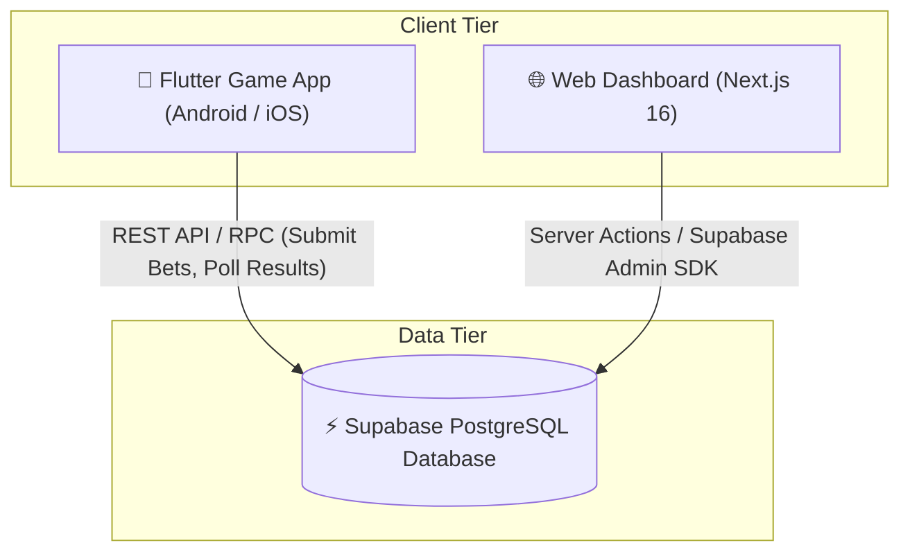

# 📘 MASTER TECHNICAL SPECIFICATION
## Web Dashboard, Database Schema & Game App Synchronization Blueprint

> **Purpose**: This document serves as the single source of truth (SSOT) for developers and AI coding agents working on the **BSG Gaming System** (Web Dashboard, Supabase Database, and Flutter Game App).

---

## 📂 System Architecture Overview

---

## 🗄️ Database Schema & Canonical Column Definitions

### 1. `triple_chance_rounds` (Global Synchronized Game Draws)
- **Primary Key**: `id` (UUID)
- **Key Columns**:
  - `round_number` (`INT8` / `BIGINT`): Incremental round index (e.g., `#101`, `#102`).
  - `scheduled_at` (`TIMESTAMPTZ`): Scheduled draw time (103-second cycle interval).
  - `status` (`TEXT`): `'ACTIVE'`, `'CALCULATING'`, `'COMPLETED'`.
  - **Digit Columns** (**CRITICAL - DO NOT ALTER ALIASES**):
    - `red` (`INT4`): Outcome digit for RED wheel (0–9).
    - `green` (`INT4`): Outcome digit for GREEN wheel (0–9).
    - `black` (`INT4`): Outcome digit for BLACK wheel (0–9).
  - `created_at` (`TIMESTAMPTZ`): Server timestamp.

> ⚠️ **CRITICAL RULE**: Column names are `red`, `green`, `black`. **NEVER** query `red_digit`, `green_digit`, or `black_digit` on `triple_chance_rounds`.

---

### 2. `triple_chance_bets` (Multiplayer Bet Records)
- **Primary Key**: `id` (UUID)
- **Key Columns**:
  - `round_id` (`UUID` $\rightarrow$ FK to `triple_chance_rounds.id`)
  - `user_id` (`UUID` $\rightarrow$ FK to `profiles.id`)
  - `single_bets` (`JSONB`): Single digit wagers `{"0": 10, "5": 50}`.
  - `double_bets` (`JSONB`): Double digit wagers `{"12": 20}`.
  - `triple_bets` (`JSONB`): Triple digit wagers `{"616": 300}`.
  - `total_stake` (`NUMERIC`): Total coins wagered by the player in this round.
  - `win_amount` (`NUMERIC`): Total coins won (payout) by player.
  - `created_at` (`TIMESTAMPTZ`): Bet placement timestamp.

---

### 3. `profiles` (User & Agent Accounts)
- **Primary Key**: `id` (UUID $\rightarrow$ FK to `auth.users.id`)
- **Key Columns**:
  - `username` (`TEXT`): Unique handle (e.g. `@player1`, `@agent1`).
  - `role` (`TEXT`): `'superadmin'`, `'agent'`, `'player'`.
  - `balance` (`NUMERIC`): Current coin balance.
  - `agent_id` (`UUID` $\rightarrow$ FK to parent agent profile ID).
  - `is_active` (`BOOLEAN`): Account active status.

---

### 4. `transactions` (Cashier Deposit & Withdrawal Ledger)
- **Primary Key**: `id` (UUID)
- **Key Columns**:
  - `user_id` (`UUID` $\rightarrow$ FK to target player or agent `profiles.id`).
  - `agent_id` (`UUID` $\rightarrow$ FK to performing agent `profiles.id`).
  - `type` (`TEXT`): `'agent_topup'`, `'agent_deduct'`, `'agent_credit'`, `'agent_debit'`, `'deposit'`, `'withdraw'`, `'admin_adjustment'`.
  - `amount` (`NUMERIC`): Coin amount (positive for deposit, negative for withdrawal).
  - `balance_after` (`NUMERIC`): Account balance post-transfer.
  - `created_at` (`TIMESTAMPTZ`).

---

## 🌐 Web Dashboard Module Mappings (`bsg_web_dashboard`)

### Module 1: `/superadmin` (System Overview & Metrics)
- **Server Action**: `src/app/superadmin/actions.ts` $\rightarrow$ `getSystemOverviewMetricsAction()`
- **Database Tables Queried**: `profiles`, `triple_chance_bets`, `transactions`, `triple_chance_rounds`.
- **Key Functionality**:
  - **Metrics Capping**: Enforces `.range(0, 999999)` on Supabase queries to bypass default 1,000-row API truncation limit.
  - Calculates Total Agents, Total Players, System Coin Liability, Today's GGR, and House Profit/Loss.

### Module 2: `/superadmin/live-game` (Live Game Monitoring & Grouped Draw Ledger)
- **Server Actions**: `src/app/superadmin/actions.ts` $\rightarrow$ `getLatestGameDrawsAction()`
- **Database Tables Queried**: `triple_chance_rounds` joined with `triple_chance_bets(*, profiles(username))`.
- **Key Functionality**:
  - **Grouped Round Architecture**: 1 row per global round (e.g. `👥 500 Players` with total wagered & net payout).
  - **Click-to-Expand Sub-Table**: Clicking a round expands a breakdown listing all individual player bets.
  - **Empty Server Rounds**: Rounds with 0 player wagers are labeled `@System (No Bets)`.

### Module 3: `/agent` (Agent Cashier & Live Telemetry)
- **Server Actions**: `src/app/agent/actions.ts` $\rightarrow$ `getAgentDashboardDataAction()`
- **Database Tables Queried**: `profiles`, `triple_chance_bets`, `transactions`.
- **Key Functionality**:
  - **`Today Bets (In)` / `Today Wins (Out)`**: Queries `triple_chance_bets` where `user_id IN (agent_player_ids)` and `created_at >= IST 00:00:00`.
  - **`Recent Coin Transfers`**: Queries `transactions` where `agent_id == agent.id` OR `user_id IN (agent_player_ids)`.

### Module 4: `/agent/players` (Player Network & Performance History)
- **Server Actions**: `src/app/agent/players/actions.ts` $\rightarrow$ `getPlayerHistoryAction()`
- **Database Tables Queried**: `profiles`, `triple_chance_bets` joined with `triple_chance_rounds(red, green, black, status)`.
- **Key Functionality**:
  - **Player Performance Summary**: Computes Total Plays, Bet Volume, Win Payout, and Net House GGR per player.
  - **Game Plays Tab**: Lists exact bet history with red/green/black outcome digits.

---

## 📱 Flutter Game App Synchronization (`bsg_app`)

1. **Clock Boundary & Round UUID Tracking**:
   - `round_sync_service.dart` captures `_lastSubmittedRoundId` during `submitBets()`.
   - Result delivery passes `_lastSubmittedRoundId` to `onGlobalResult()`, guaranteeing win calculation and balance sync target the exact round ID where bets were stored in DB.

2. **Session-Only Game History**:
   - `api_service.dart` appends `&created_at=gte.<sessionStartISO>` to PostgREST queries.
   - On player logout and re-login, history resets to current session view as configured.

3. **Protected Local Win Balance**:
   - `game_provider.dart` updates balance from background network sync ONLY if `myResult.isResolved == true` or if outcome was not a win, preventing stale responses from overwriting local win payouts.

4. **In-Place APK Updates**:
   - App version incremented to `1.0.1+2` in `pubspec.yaml` so Android OS performs direct in-place updates without uninstallation.

---

## ⛔ Non-Negotiable Development Rules

1. **NEVER Guess Column Names**: Always use `red, green, black` for `triple_chance_rounds`.
2. **ALWAYS Test Next.js Build**: Always run `npm run build` in `bsg_web_dashboard` to verify TypeScript types before pushing to GitHub.
3. **NEVER Swallow Command Failures**: Always inspect full error logs upon any runtime failure.
